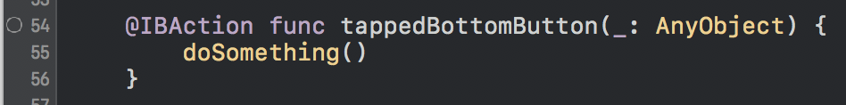

[](https://travis-ci.org/fastred/IBAnalyzer) [](https://codecov.io/gh/fastred/IBAnalyzer)

# IBAnalyzer

Find common xib and storyboard-related problems without running your app or writing unit tests.

## Usage

Pass a path to your project to `ibanalyzer` command line tool. Here's an example output you can expect:

```
$ ./ibanalyzer ~/code/Sample/

TwitterViewController doesn't implement a required @IBAction named: loginButtonPressed:
TwitterViewController doesn't implement a required @IBOutlet named: twitterImageView
LoginViewController contains unused @IBAction named: onePasswordButtonTapped:
MessageCell contains unused @IBOutlet named: unreadIndicatorView
MessagesViewController contains unused @IBAction named: infoButtonPressed
```

With IBAnalyzer, you're able to:

1. Find unimplemented outlets & actions in classes. Avoid crashes caused by exceptions, like the dreadful:
    ```
    *** Terminating app due to uncaught exception 'NSUnknownKeyException', reason: '
    [<Sample.TwitterViewController 0x7fa84630a370> setValue:forUndefinedKey:]: this
     class is not key value coding-compliant for the key twitterImageView.'
    ```

2. Find `@IBOutlet`s and `@IBAction`s defined in code but not connected to from nibs. No more:

    

    and

    

## Drawbacks

This is a new tool, used only on a handful of projects till now. If you encounter any bugs, please create new issues.

**Doesn't work with Objective-C. Tested on Swift 3.0.**

## How It Works

IBAnalyzer starts by parsing all `.xib,` `.storyboard` and `.swift` files in the provided folder. It then uses this data (wrapped in `AnalyzerConfiguration`) to generate warnings. You can see the source of an analyzer [checking connections between source code and nibs here](https://github.com/fastred/IBAnalyzer/blob/master/IBAnalyzer/Analyzers/ConnectionAnalyzer.swift).

New warnings can be implemented by adding a new type conforming to the `Analyzer` protocol and initializing it in `main.swift`. Check [issues](https://github.com/fastred/IBAnalyzer/issues) to learn about some ideas for new warnings.

## Installation

### CocoaPods (Build Phase integration)

Note: This can significantly slow-down your build times.

1. Add `pod 'IBAnalyzer'` to your `Podfile`.
1. Run `pod repo update` and then `pod install`.
1. Go to target settings -> Build Phases and add a `New Run Script Phase`. Change its name to something like `IBAnalyzer`.
1. Use this script to run analysis on all files in your repository (possibly including 3rd party dependencies, like `Pods/`):

    ```
    "${PODS_ROOT}/IBAnalyzer/bin/ibanalyzer" ./
    ```
    
    or this one to run analysis only on a single folder:
    
    ```
    "${PODS_ROOT}/IBAnalyzer/bin/ibanalyzer" FolderName/
    ```

### Binary

Download the newest prebuilt binary from the [Releases](https://github.com/fastred/IBAnalyzer/releases) tab. Unpack and run using:

```
$ bin/ibanalyzer /path/to/your/project
```

### From Source

1. Clone or download the repo.
1. Open `IBAnalyzer.xcworkspace` in Xcode 8.2 and build the project (⌘-B).
1. `$ cd Build/MacOS`
1. `$ ./ibanalyzer /path/to/your/project`

## Attributions

- [SourceKitten](https://github.com/jpsim/SourceKitten) – IBAnalyzer wouldn't be possible without it
- [SwiftGen](https://github.com/AliSoftware/SwiftGen) – inspiration for `NibParser`
- [Sourcery](https://github.com/krzysztofzablocki/Sourcery) – IBAnalyzer uses pretty much the same `Rakefile`

## Author

Project initially started by [Arek Holko](http://holko.pl) ([@arekholko](https://twitter.com/arekholko) on Twitter).
